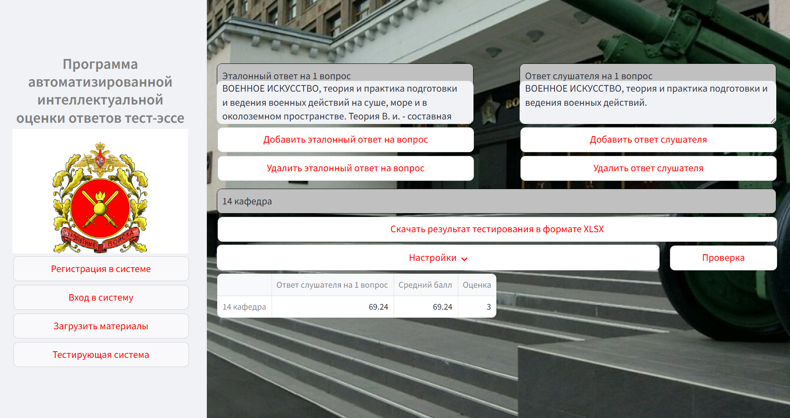

# **Тестирующая система на базе LLM.**
Настоящий программный продукт является прототипом тестирующей системы на базе больших языковых моделей, разработанной для оценки ответов слушателей Общевойсковой академии Вооружённых сил Российской Федерации. 

В основе  лежит модель искусственной нейронной сети <strong>BGE-M3</strong> от <strong>Beijing Academy of Artificial Intelligence</strong>.
 
 
Оценка релевантности ответов слушателей и эталонных ответов осуществляется с использованием большой языковой модели <strong>gemma2-9b-it</strong> от компании Google.
 
 

Графический интерфейс для работы с API содержит два блока текстовых полей: источник и ответ (названия и нумерация вставляются автоматически, но могут быть изменены при желании). Кнопки “Добавить эталонный ответ на вопрос / ответ слушателя” добавляют новые поля в соответствующие блоки, а кнопки “Удалить эталонный ответ на вопрос / ответ слушателя” удаляют их в режиме LIFO (т.е. с последнего добавленного):

 

 

Можно сделать ряд настроек, для изменения расчёта схожести. Чтобы они применялись нужно 
нажать кнопку “Проверка” (благодаря кэшированию операция обновления должна быть практически 
мгновенной – основное время занимает кодирование текстов нейросетью и этот этап в данном случае 
пропускается). 
 
Первый пункт: “Показать всё”. При нажатии можно увидеть все данные, возвращаемые через API. 
Всего будет четыре основных поля: score, dense, sparse, colbert для каждого ответа. Поле “score” – это 
рассчитанная итоговая мера схожести пары текстов. Оно получается из трёх оставшихся полей, значения 
которых получены от нейросети, где: 
 
 
● <strong>dense</strong> – это оценка семантической (смысловой) схожести текстов. На неё минимально влияет 
стилистика текста (то, как именно он написан, какие используются слова и т.д.), только смысл. Эта 
оценка наиболее репрезентативна, если в сравниваемых текстах представлена какая-то конкретная 
идея (мысль). 
 
 
● <strong>sparse</strong> – это оценка схожести по словам (точнее, токенам), из которых составлены тексты. Она 
будет нулевой, если в текстах вообще нет никаких одинаковых слов или выражений. Но даже для 
практически идентичных по словам текстов она достаточно невысокая. Имеет смысл обращать на 
неё внимание, если предполагается наличие каких-то ключевых в слов в ответе для корректности. 
 
● <strong>colbert</strong> – это ещё одна семантическая оценка, но в ней текст не сжимается в единичный вектор (как 
в случае с dense), а представляется в виде набора векторов – по одному для каждого токена (слова). 
Данная оценка лучше подходит для сравнения текстов, где важен не только смысл, но и 
используемые слова и выражения, а также для текстов, где содержится сразу несколько 
несвязанных мыслей. 
Более подробно про эти оценки можно почитать в статье (https://arxiv.org/pdf/2402.03216), пункт 3.2 
Hybrid Retrieval, где подпункт Dense retrieval соответствует оценке dense, Lexical Retrieval оценке sparse 
и Multi-Vector Retrieval оценке colbert. 
